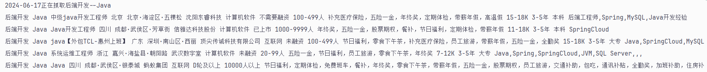
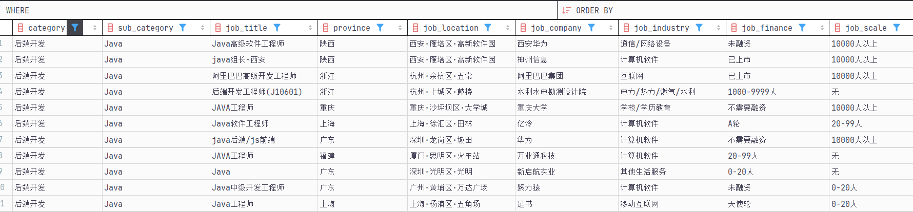

# boss-selenium
使用python+selenium完成对boss互联网相关岗位的数据爬取，如果对您有所帮助，请对项目进行star鼓励一下作者。

作者未及时回复信息，请扫码催促作者


## 1. 环境准备
**安装项目依赖库**
```cmd
pip install -r requirements.txt
```
**创建数据库和表**
```sql
drop database if exists spider_db;
create database if not exists spider_db;
       
use spider_db;

drop table if exists job_info;
create table spider_db.job_info
(
    category         varchar(255) null comment '一级分类',
    sub_category     varchar(255) null comment '二级分类',
    job_title        varchar(255) null comment '岗位名称',
    province         varchar(100) null comment '省份',
    job_location     varchar(255) null comment '工作位置',
    job_company      varchar(255) null comment '企业名称',
    job_industry     varchar(255) null comment '行业类型',
    job_finance      varchar(255) null comment '融资情况',
    job_scale        varchar(255) null comment '企业规模',
    job_welfare      varchar(255) null comment '企业福利',
    job_salary_range varchar(255) null comment '薪资范围',
    job_experience   varchar(255) null comment '工作年限',
    job_education    varchar(255) null comment '学历要求',
    job_skills       varchar(255) null comment '技能要求',
    create_time      varchar(50)  null comment '抓取时间'
);
```


## 2.运行测试
```cmd
python boss_selenium.py
```

## 3.运行结果
控制台显示:

数据库：

